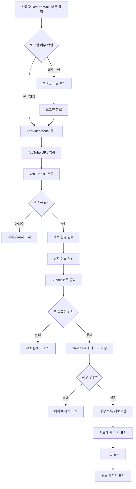

# Walkingtube - YouTube 영상 등록 프로세스

**작성일**: 2025-12-23  
**버전**: 1.0.0  
**프로젝트**: Walkingtube

---

## 📋 개요

Walkingtube에서 사용자가 지도 위에 YouTube 영상을 등록하는 전체 프로세스를 설명합니다. 현재 이 기능은 **미구현 상태**이며, 본 문서는 향후 개발을 위한 설계 및 구현 가이드입니다.

---

## 🎯 기능 요구사항

### 사용자 시나리오
1. **사용자 인증**: 로그인한 사용자만 영상을 등록할 수 있음
2. **위치 선택**: 지도에서 영상을 등록할 위치를 선택
3. **영상 정보 입력**: YouTube 영상 URL 및 메타데이터 입력
4. **저장 및 표시**: 영상을 데이터베이스에 저장하고 지도에 마커로 표시

### 비즈니스 규칙
- ✅ 인증된 사용자만 영상 등록 가능 (Supabase RLS로 보장)
- ✅ YouTube 동영상 ID 자동 추출 지원
- ✅ 사용자의 현재 위치를 기본값으로 제공
- ✅ 위치명 자동 생성 또는 사용자 정의 가능

---

## 🗂️ 데이터베이스 구조

### Videos 테이블 스키마
```sql
create table videos (
  id uuid default gen_random_uuid() primary key,
  title text not null,                    -- 영상 제목
  youtube_id text not null,                -- YouTube 영상 ID
  latitude float8 not null,                -- 위도
  longitude float8 not null,               -- 경도
  description text,                        -- 영상 설명 (선택)
  location_name text,                      -- 위치명 (선택)
  author_id uuid references auth.users(id),-- 작성자 ID
  created_at timestamp with time zone      -- 생성 시간
    default timezone('utc'::text, now()) not null
);
```

### Row Level Security (RLS) 정책
```sql
-- 모든 사용자가 영상 조회 가능
create policy "Public videos are viewable by everyone"
  on videos for select
  using ( true );

-- 인증된 사용자만 본인의 영상 등록 가능
create policy "Users can insert their own videos"
  on videos for insert
  with check ( auth.uid() = author_id );
```

---

## 🏗️ 시스템 아키텍처

### 프론트엔드 구조
```
src/
├── components/
│   ├── map/
│   │   └── MapContainer.tsx          → "Record Walk" 버튼 위치
│   └── video/
│       ├── VideoModal.tsx             → 영상 조회 모달 (기존)
│       └── AddVideoModal.tsx          → 영상 등록 모달 (신규 필요)
├── lib/
│   └── api.ts                         → API 함수 (addVideo 함수 추가 필요)
└── types/
    └── video.ts                       → Video 인터페이스 (기존)
```

---

## 📝 구현 단계별 가이드

### 1단계: AddVideoModal 컴포넌트 생성

#### 파일: `src/components/video/AddVideoModal.tsx`

**UI 구성 요소**:
- YouTube URL 입력 필드
- 제목 입력 필드 (자동 채움 옵션)
- 설명 입력 필드 (선택)
- 위치명 입력 필드
- 위도/경도 표시 (읽기 전용)
- 제출 버튼 및 취소 버튼

**주요 기능**:
```tsx
interface AddVideoModalProps {
  isOpen: boolean;
  onClose: () => void;
  latitude: number;
  longitude: number;
  onVideoAdded?: () => void;
}
```

**YouTube ID 추출 로직**:
```typescript
function extractYouTubeId(url: string): string | null {
  // YouTube URL 형식:
  // https://www.youtube.com/watch?v=VIDEO_ID
  // https://youtu.be/VIDEO_ID
  const patterns = [
    /(?:youtube\.com\/watch\?v=|youtu\.be\/)([a-zA-Z0-9_-]{11})/,
    /youtube\.com\/embed\/([a-zA-Z0-9_-]{11})/
  ];
  
  for (const pattern of patterns) {
    const match = url.match(pattern);
    if (match) return match[1];
  }
  return null;
}
```

---

### 2단계: API 함수 추가

#### 파일: `src/lib/api.ts`

**함수 추가**:
```typescript
export interface AddVideoInput {
  title: string;
  youtubeId: string;
  latitude: number;
  longitude: number;
  description?: string;
  locationName?: string;
}

export async function addVideo(input: AddVideoInput): Promise<Video | null> {
  const { data: { user } } = await supabase.auth.getUser();
  
  if (!user) {
    throw new Error('User must be authenticated to add videos');
  }

  const { data, error } = await supabase
    .from('videos')
    .insert([
      {
        title: input.title,
        youtube_id: input.youtubeId,
        latitude: input.latitude,
        longitude: input.longitude,
        description: input.description,
        location_name: input.locationName,
        author_id: user.id,
      },
    ])
    .select()
    .single();

  if (error) {
    console.error('Error adding video:', error);
    throw error;
  }

  // Map to camelCase
  return {
    id: data.id,
    title: data.title,
    youtubeId: data.youtube_id,
    latitude: data.latitude,
    longitude: data.longitude,
    description: data.description,
    locationName: data.location_name,
    authorId: data.author_id,
    createdAt: data.created_at,
  };
}
```

---

### 3단계: MapContainer에 통합

#### 파일: `src/components/map/MapContainer.tsx`

**상태 추가**:
```typescript
const [isAddVideoModalOpen, setIsAddVideoModalOpen] = useState(false);
const [selectedLocation, setSelectedLocation] = useState<{
  latitude: number;
  longitude: number;
} | null>(null);
```

**"Record Walk" 버튼 수정** (현재 라인 186-191):
```tsx
<Button
  onClick={() => {
    // 현재 사용자 위치 또는 지도 중심 사용
    setSelectedLocation({
      latitude: viewState.latitude,
      longitude: viewState.longitude,
    });
    setIsAddVideoModalOpen(true);
  }}
  className="h-14 px-8 bg-primary text-white rounded-full shadow-2xl hover:scale-105 transition-all font-bold text-lg"
>
  <Plus className="w-6 h-6 mr-2" />
  Record Walk
</Button>
```

**모달 렌더링**:
```tsx
<AddVideoModal
  isOpen={isAddVideoModalOpen}
  onClose={() => setIsAddVideoModalOpen(false)}
  latitude={selectedLocation?.latitude ?? viewState.latitude}
  longitude={selectedLocation?.longitude ?? viewState.longitude}
  onVideoAdded={async () => {
    // 영상 목록 새로고침
    const data = await fetchVideos();
    setVideos(data);
    setIsAddVideoModalOpen(false);
  }}
/>
```

---

## 🎨 UI/UX 디자인 가이드

### 디자인 원칙
1. **일관성**: 기존 VideoModal 스타일과 일관성 유지
2. **접근성**: 모바일 친화적인 터치 타겟 크기
3. **피드백**: 로딩 상태 및 에러 메시지 명확히 표시

### 추천 레이아웃
```
┌─────────────────────────────┐
│   Add Your Walking Video    │
├─────────────────────────────┤
│                             │
│  YouTube URL *              │
│  ┌─────────────────────┐   │
│  │ https://youtube...  │   │
│  └─────────────────────┘   │
│                             │
│  Video Title *              │
│  ┌─────────────────────┐   │
│  │ My Amazing Walk     │   │
│  └─────────────────────┘   │
│                             │
│  Description (Optional)     │
│  ┌─────────────────────┐   │
│  │ Beautiful sunset... │   │
│  └─────────────────────┘   │
│                             │
│  Location Name              │
│  ┌─────────────────────┐   │
│  │ Hangang Park        │   │
│  └─────────────────────┘   │
│                             │
│  📍 37.5665, 126.9780      │
│                             │
│  [Cancel]  [Add Video]     │
└─────────────────────────────┘
```

---

## 🧪 테스트 시나리오

### 정상 케이스
1. ✅ 로그인한 사용자가 유효한 YouTube URL 입력
2. ✅ 제목과 위치 정보 입력 후 저장
3. ✅ 지도에 새 마커가 즉시 표시됨
4. ✅ 저장된 영상을 클릭하여 재생 가능

### 에러 케이스
1. ❌ 로그인하지 않은 사용자가 접근 시도 → 로그인 유도
2. ❌ 잘못된 YouTube URL 입력 → 에러 메시지 표시
3. ❌ 필수 필드 누락 → 유효성 검사 실패 메시지
4. ❌ 네트워크 오류 → 재시도 옵션 제공

### Edge Cases
- 매우 긴 제목 (100자 이상)
- 특수 문자가 포함된 입력
- YouTube Shorts URL
- 비공개 YouTube 영상 URL

---

## 🔒 보안 고려사항

### 프론트엔드 검증
```typescript
// YouTube ID 형식 검증
function isValidYouTubeId(id: string): boolean {
  return /^[a-zA-Z0-9_-]{11}$/.test(id);
}

// 좌표 범위 검증
function isValidCoordinate(lat: number, lng: number): boolean {
  return lat >= -90 && lat <= 90 && lng >= -180 && lng <= 180;
}

// 입력 길이 제한
const MAX_TITLE_LENGTH = 200;
const MAX_DESCRIPTION_LENGTH = 1000;
const MAX_LOCATION_NAME_LENGTH = 100;
```

### 백엔드 보안 (Supabase RLS)
- ✅ `author_id`가 현재 로그인한 사용자 ID와 일치하는지 자동 검증
- ✅ 공개 읽기, 인증된 사용자만 쓰기 가능
- ✅ SQL Injection 방지 (Supabase SDK 사용)

---

## 🚀 배포 전 체크리스트

### 필수 구현 사항
- [ ] AddVideoModal 컴포넌트 생성
- [ ] addVideo API 함수 구현
- [ ] MapContainer에서 모달 통합
- [ ] YouTube ID 추출 로직 구현
- [ ] 폼 유효성 검사
- [ ] 에러 핸들링

### 선택적 개선 사항
- [ ] YouTube API로 영상 제목 자동 가져오기
- [ ] 지도 클릭으로 위치 선택 기능
- [ ] 이미지 업로드 (썸네일)
- [ ] 태그 시스템
- [ ] 영상 편집/삭제 기능

### 테스트
- [ ] 단위 테스트 (YouTube ID 추출 함수)
- [ ] 통합 테스트 (API 호출)
- [ ] E2E 테스트 (전체 플로우)
- [ ] 모바일 반응형 테스트

---

## 📚 참고 자료

### YouTube URL 패턴
- 일반: `https://www.youtube.com/watch?v=VIDEO_ID`
- 단축: `https://youtu.be/VIDEO_ID`
- 임베드: `https://www.youtube.com/embed/VIDEO_ID`
- Shorts: `https://www.youtube.com/shorts/VIDEO_ID`

### Supabase 문서
- [Row Level Security](https://supabase.com/docs/guides/auth/row-level-security)
- [Insert Data](https://supabase.com/docs/reference/javascript/insert)
- [Auth Helpers](https://supabase.com/docs/guides/auth/auth-helpers/nextjs)

### Mapbox GL JS
- [Add Custom Marker](https://docs.mapbox.com/mapbox-gl-js/example/custom-marker-icons/)
- [Get User Location](https://docs.mapbox.com/mapbox-gl-js/example/locate-user/)

---

## 🔄 개발 프로세스 플로우



---

## 💡 추가 기능 아이디어

### Phase 2
1. **영상 편집/삭제**: 본인이 등록한 영상 수정/삭제
2. **좋아요/북마크**: 마음에 드는 영상 저장
3. **댓글 시스템**: 영상에 댓글 작성
4. **공유 기능**: 소셜 미디어 공유

### Phase 3
1. **AI 태그 자동 생성**: YouTube 영상 내용 분석
2. **경로 그리기**: 여러 영상을 연결하여 워킹 루트 생성
3. **통계 대시보드**: 조회수, 인기 지역 분석
4. **푸시 알림**: 새 영상 알림

---

## 📞 문제 해결

### 자주 발생하는 오류

#### 1. "User must be authenticated" 에러
**원인**: 로그인하지 않은 상태에서 영상 등록 시도  
**해결**: 사용자에게 로그인하도록 유도

#### 2. "Invalid YouTube URL" 에러
**원인**: YouTube URL 형식이 올바르지 않음  
**해결**: URL 예시 표시 및 검증 로직 개선

#### 3. "RLS policy violation" 에러
**원인**: author_id가 현재 사용자 ID와 불일치  
**해결**: API 함수에서 auth.uid() 자동 설정

#### 4. 지도에 마커가 표시되지 않음
**원인**: 영상 목록이 새로고침되지 않음  
**해결**: onVideoAdded 콜백에서 fetchVideos() 호출

---

## ✅ 현재 구현 상태

### ✅ 완료된 기능
- 영상 조회 (VideoModal)
- 영상 목록 가져오기 (fetchVideos)
- 지도에 마커 표시 (VideoMarker)
- 사용자 인증 (AuthModal)
- 데이터베이스 스키마

### ⏳ 미완성 기능
- 영상 등록 UI (AddVideoModal)
- 영상 등록 API (addVideo)
- "Record Walk" 버튼 기능 연결
- YouTube ID 추출 로직

---

**작성자**: Antigravity AI  
**최종 수정**: 2025-12-23  
**문서 버전**: 1.0.0
